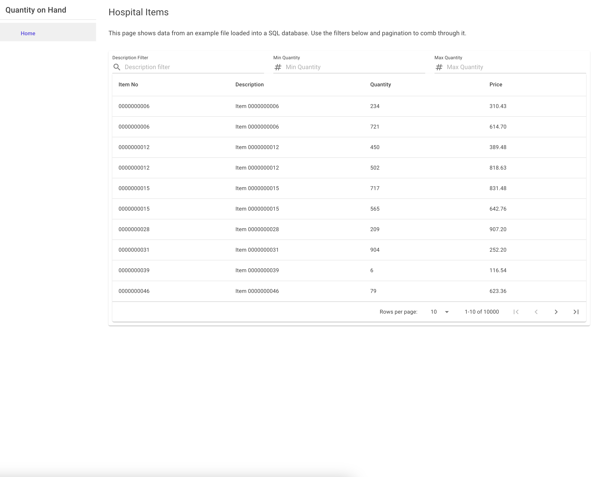

# Quantity On Hand

The goal of this project is to demonstrate my current C# .NET development skillset. This is not a fully polished project
and time constraints should be taken into consideration when reviewing it.

#### Video Demonstration:
https://share.cleanshot.com/lXpV1xC3
#### Screenshot:



## Project Overview

The solution consists of the following core projects:

### Core Technologies:

- .NET 8.0
- Blazor Server
- MediatR
- Entity Framework Core
- SQL Server
- NUnit

---

### QuantityOnHand.Web

**Description:**  
Serves as the entry point for the application. Exposes the functionality of the system through a Blazor Web UI that
interacts with the domain layer using MediatR.

**Technologies Used:**

- ASP.NET Core
- Blazor Server

**What It Exemplifies:**

- User interface development and design
- Utilization of a messaging pattern to interact with a domain layer
- SPA functionality through Blazor

---

### QuantityOnHand.Domain

**Description:**  
Defines the core business logic and domain models of the application. This is the heart of the system, where the rules
and validations are applied.

**Technologies Used:**

- C#
- MediatR
- Command/Query/Handler/Validator approach

**What It Exemplifies:**

- Separation of concerns
- Reusability of core logic across different layers
- Messaging patterns

---

### QuantityOnHand.Data

**Description:**  
Handles the persistence layer of the application. Includes database configurations, migrations, and repositories for
CRUD operations.

**Technologies Used:**

- Entity Framework Core
- SQL Server

**What It Exemplifies:**

- Repository pattern for data access
- Database migrations and schema management
- Proper separation of data access logic

---

### QuantityOnHand.Domain.Tests

**Description:**  
Contains unit tests for the domain layer to ensure all business rules and validations function as expected.

**Technologies Used:**

- NUnit 3

**What It Exemplifies:**

- Validation of business logic through unit tests
- High test coverage of critical logic

---

### QuantityOnHand.Data.Tests

**Description:**  
Contains unit and integration tests for the data layer, ensuring the correctness of repositories and database
interactions.

**Technologies Used:**

- NUnit 3
- Moq
- In-Memory Database for testing

**What It Exemplifies:**

- Test-driven development (TDD)
- Mocking and dependency injection in tests
- Ensuring data consistency through tests

---

## Assumptions, Risks, and Concerns

1. **Database Assumptions:**
    - Assumes SQL Server is available and configured. If a different database is required, minor adjustments to Entity
      Framework configurations may be needed.

2. **Testing Risks:**
    - Tests rely on an in-memory database, which may not perfectly replicate production database behavior. There is a
      risk of missing edge cases that only occur with the production setup.
    - The base repository was tested but not inherited members due to time constraints.

3. **Scalability Concerns:**
    - The current design works well for small to medium-sized systems. If the system scales significantly, caching or
      additional architectural changes may be required.
    - There is no authentication layer, anyone could access this application and it's data.

---

## Getting Started

1. Clone the repository:
   ```bash
   git clone <repository-url>
   ```
2. Navigate to the source directory
   ```bash
   cd QuantityOnHand
   ```
3. Update your database with the latest migrations
   ```bash
   dotnet ef database update --project QuantityOnHand.Data
   # Additionally, you can CD into the data project and exclude the --project flag
   # This assumes you've either spun up your own SQL instance or are using the version supplied in docker-compose.yml
   # This assumes you've configured your connection string in appsettings.json
   ```
4. Run the project
   ```bash
   dotnet run --project QuantityOnHand.Web
   ```